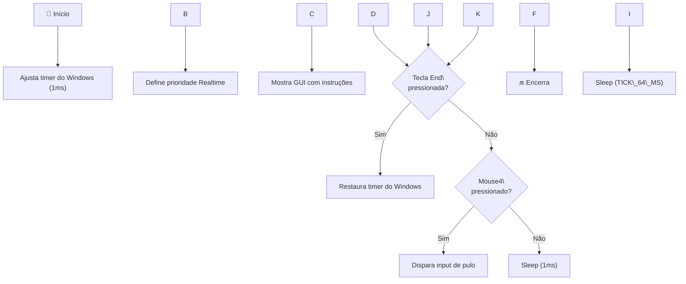

# CS2-AHK-Bhop — Documentação do Projeto

Pula, pula, pula! Um script AutoHotKey pra você sair pulando feito um coelhinho nas partidas de CS2. Este documento descreve tudo que você precisa saber sobre o repositório, desde o que cada script faz até como o código funciona por dentro.

> \[!CAUTION]
> \*\*A Valve desativou todos os movement binds.\*\* Isso significa que, atualmente, esses scripts \*\*não funcionam mais\*\*. Esse repositório serve como referência histórica e educacional. F no chat. 😔

\---

## Visão Geral

O repositório contém **4 scripts AutoHotKey** que automatizam o bunny hop (bhop) no Counter-Strike 2. Em vez de você ficar quebrando a rodinha do mouse ou martelando o espaço, o script faz o trabalho pesado por você. Basicamente, você segura um botão do mouse e o script simula os inputs de pulo no timing certo pra manter a velocidade do bhop.

\---

## Os 4 Scripts

### SpaceOnly — A versão simples

#### \[SCRIPT] [BhopCS2-SpaceOnly ( No scrollwheel bind ).ahk](file:///c:/Users/mairon.dscosta/dev/harness02/CS2-AHK-Bhop/BhopCS2-SpaceOnly%20%28%20No%20scrollwheel%20bind%20%29.ahk)

A versão mais simples e direta. Ele pula usando a barra de espaço, sem precisar de nenhum bind de scrollwheel no console do CS2. O tick rate dele é de **15.6ms**. Se você só quer testar o bhop sem configurar nada, é esse aqui. Não precisa colar nenhum comando no console — é só rodar e ser feliz.

\---

### V2 — A versão clássica

#### \[SCRIPT] [BhopCS2-V2.ahk](file:///c:/Users/mairon.dscosta/dev/harness02/CS2-AHK-Bhop/BhopCS2-V2.ahk)

A versão clássica. Ele simula o scroll do mouse pra baixo pra disparar o pulo, o que casa melhor com o sistema de bind do CS2. Também usa tick de **15.6ms**. É a evolução natural do SpaceOnly — troca o espaço pelo scroll, que é mais confiável dentro do jogo.

\---

### V4.1 — A versão afinada

#### \[SCRIPT] [BhopCS2-V4.1.ahk](file:///c:/Users/mairon.dscosta/dev/harness02/CS2-AHK-Bhop/BhopCS2-V4.1.ahk)

O V2 com o timing mais refinado. Usa um tick de **13.5ms** e multiplica os intervalos de sleep por **0.99**, o que torna o ritmo dos pulos levemente mais agressivo. Na prática, a diferença é sutil mas faz diferença em superfícies planas. Se você quer consistência, é esse.

\---

### V5 (JumpBug) — O pacote completo

#### \[SCRIPT] [BhopCS2-V5 ( Now with jumpbug ).ahk](file:///c:/Users/mairon.dscosta/dev/harness02/CS2-AHK-Bhop/BhopCS2-V5%20%28%20Now%20with%20jumpbug%20%29.ahk)

A versão mais completa. Tem tudo que o V4.1 tem, mais suporte a **jumpbug** — aquela técnica onde você solta o agachamento e pula no timing certo pra não tomar dano de queda. Se você quer o pacote completo, é esse.

> \[!TIP]
> O jumpbug é considerado experimental pelo próprio autor, mas segundo ele: \*"It's better than I thought"\*.

\---

## Como Usar

### Pré-requisitos

Você precisa ter o **AutoHotKey** instalado no PC (disponível em autohotkey.com) e o **CS2** aberto.

### Configuração do Console (por versão)

**SpaceOnly** — Não precisa configurar nada no console do CS2. Zero stress.

**V2 / V4.1 / V5** — Precisa do bind de scroll. O mais simples é:

```
bind mwheeldown +jump;
```

Para mais consistência com de-subtick:

```
alias +jump\_ "+jump;+jump"
alias -jump\_ "-jump;-jump;-jump"
bind mwheeldown +jump\_;
```

**V5 (extra jumpbug)** — Além dos binds acima, adicione:

```
alias +jb "-duck\_;-duck\_;-duck\_;+jump\_;+jump\_"
alias -jb "-jump\_;-jump\_;-jump\_"
bind "mwheeldown" "+jb"
```

### Execução

Dê duplo clique no arquivo `.ahk` escolhido. Uma janelinha preta vai abrir com as instruções — é normal, não é vírus. Dentro do jogo, segure **Mouse4** (botão lateral) enquanto se move pra ativar o bhop. Pra fechar, pressione **End**.

\---

## Como Funciona Por Dentro

> \[!NOTE]
> Todos os 4 scripts seguem a mesma arquitetura base. As diferenças são: método de input (espaço vs scroll), valor do tick rate (15.6ms vs 13.5ms) e multiplicador do sleep (1x vs 0.99x).

O script começa chamando `timeBeginPeriod(1)`, que reduz a resolução do timer do Windows pra 1 milissegundo. Sem isso, o comando Sleep do Windows tem uma precisão horrível de uns 15ms, o que bagunçaria todo o timing dos pulos.

Depois, define a prioridade do processo como **Realtime** (a máxima do Windows), garantindo que o script ganhe mais tempo de CPU e sofra menos atrasos.

Em seguida, monta uma interface gráfica simples (a janelinha preta) mostrando as instruções e os comandos de console necessários.

O coração é um **loop principal** que roda até você pressionar End. Dentro dele, verifica se o Mouse4 está pressionado. Se estiver, dispara os inputs de pulo com intervalos baseados no `TICK\_64\_MS`. Se não, descansa por 1ms e verifica de novo.

Quando você pressiona End, o script chama `timeEndPeriod` pra restaurar o timer do Windows e encerra tudo limpinho.



\---

## Controles

O **Mouse4** (botão lateral do mouse) serve pra ativar e segurar o bhop enquanto você estiver no jogo. A tecla **End** no teclado fecha o script por completo.

\---

## Dicas e Avisos

> \[!IMPORTANT]
> O bhop funciona melhor em \*\*superfícies planas\*\*. Terrenos irregulares quebram o ritmo e você perde velocidade. Você \*\*ainda precisa saber strafar\*\* — o script só cuida do pulo, não da direção.

O bhop no CS2 tem um componente de sorte por causa do sistema de sub-tick, então não espere 100% de sucesso em todo pulo.

\---

## Segurança

O script **não dá VAC ban** porque é apenas um AutoHotKey que simula inputs do teclado e mouse — não injeta nada no jogo e não modifica nenhum arquivo.

> \[!WARNING]
> Pode dar \*\*ban de Overwatch\*\* se alguém te reportar e o reviewer perceber que seus pulos são consistentes demais. Em servidores com anti-cheat de terceiros (Faceit, ESEA), o AHK é detectado e bloqueado.

\---

## Créditos

**Ryuu43** — Autor e modificador principal dos scripts. **McDaived** — Assets e contribuições visuais do repositório.

*"A vida é curta demais pra não dar bhop."* 🐇

